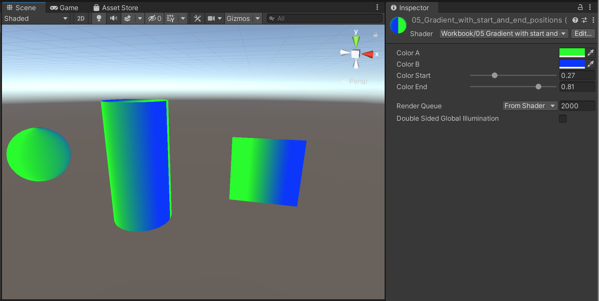

# 5. Gradient with start and end positions shader

As an extension to #4, add the ability to customize _where_ the start color begins, and the end color ends. (For example, in #4 the start color displays at `uv.x == 0`. How might you position the start of the gradient differently?)

Example:

