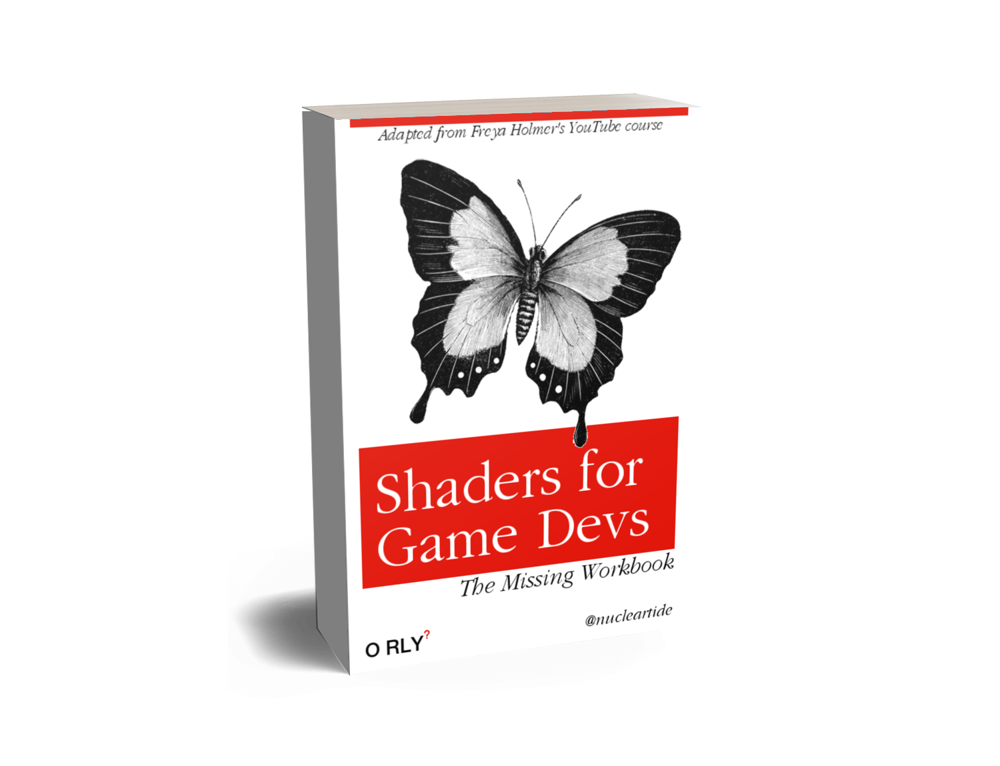

# Shaders for Game Devs: The Missing Workbook

> A workbook of exercises to accompany Freya Holmer's [Shaders for Game Devs course](https://www.youtube.com/playlist?list=PLImQaTpSAdsCnJon-Eir92SZMl7tPBS4Z).

## Motivation

Shader writing is kind of a dark art.

With the ability to write shaders, you can transcend the "Unity look", and make your game look the way you want with the power of math.

However, while there are many tutorials on specific shader effects, it's hard to find a tutorial that builds your foundational skillset for that knowledge to hang on.

Luckily for us, Freya Holmer demystifies the skill in her [comprehensive YouTube course about writing shaders in Unity](https://www.youtube.com/playlist?list=PLImQaTpSAdsCnJon-Eir92SZMl7tPBS4Z).

This repo accompanies that video course, and in math textbook style provides a collection of "end of chapter" exercises to apply your understanding of what Freya teaches.

It is mostly drawn from Freya's code demos, but can/will be extended in the future to additional practice questions that test your shader skills.

## Exercises

1. [Single color shader](./Exercises/01_Single_color.md)
2. [Mango shader](./Exercises/02_Mango.md)
3. [UV visualization shader](./Exercises/03_UV_visualization.md)
4. [Gradient shader](./Exercises/04_Gradient.md)
5. [Gradient with start and end positions shader](./Exercises/05_Gradient_with_start_and_end_positions.md)
6. (More to come soon...)

## Answers

1. [Single color shader](./Assets/Shaders/01_Single_color.shader)
2. [Mango shader](./Assets/Shaders/02_Mango.shader)
3. [UV visualization shader](./Assets/Shaders/03_UV_visualization.shader)
4. [Gradient shader](./Assets/Shaders/04_Gradient.shader)
5. [Gradient with start and end positions shader](./Assets/Shaders/05_Gradient_with_start_and_end_positions.shader)
6. (More to come soon...)

## Contributing

Have a practice question you'd like to add? Please feel free to [open a pull request](https://github.com/nucleartide/Shaders-for-Game-Devs-Workbook/pulls)!

---

> To be notified of updates to this repo (especially when new exercises are added), please watch this repo. :eyes:
>
> This repo was created by Jason Tu. For more educational content about game dev with Unity, see: [YouTube](https://youtube.com/nucleartide) · [Blog](https://jasont.co/) · [Twitter](https://twitter.com/nucleartide)
